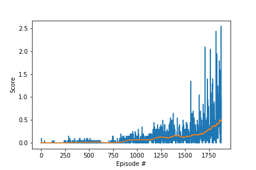

# Report

## Learning Algorithm

We used a model [Deep Deterministic Policy Gradient(DDPG)](https://arxiv.org/pdf/1509.02971.pdf) model.  
The model is a mix between Actor Critic and DQN for continuous action space problems.  
The actor produces a deterministic policy instead of a stochastic policy and the critic evaluates it.  
To stabilize the learning, the model implements Fixed targets and Experience Replay  originally used for DQN where for Fixed targets, every network gets a target for a certain time and for Experience Replay, we store a buffer of experiences and we learn from them in a shuffled order to fight against the correlation between the sequence of experiences appeared over time.  
Another technique called soft update is used: Instead of copying the weights of the online network to make the target network we add 99.99% of the target network weights are added to 0.01% of the online network weights.


### DQN Hyperparameters
- BUFFER_SIZE = 100000, replay buffer size
- BATCH_SIZE = 128, minibatch size
- GAMMA = 0.99, discount factor
- TAU = 0.001, for soft update of target parameters
- LR_ACTOR = 0.0001, learning rate of the actor 
- LR_CRITIC = 0.0001, learning rate of the critic
- WEIGHT_DECAY = 0.0001, L2 weight decay


### Actor Neural Network
The neural network defined in model.py has 3 fully connected layers.
The dimension of the first is state_size * 256, the second is 256 * 256 using Relu activation function for both and the third 256 * action_size using tanh activation function.

### Critic Neural Network
The neural network defined in model.py has 3 fully connected layers.
The first layer has a size of state_size * 256, the second has a size of (256 + action_size) * 256, the third 256 * 256 and a final layer with a size of 256 * 1.
All the layers except the final one use leaky_relu activation function.    

## Plot of rewards



```
Episode 100	Average Score: 0.000
Episode 200	Average Score: 0.003
Episode 300	Average Score: 0.013
Episode 400	Average Score: 0.005
Episode 500	Average Score: 0.012
Episode 600	Average Score: 0.023
Episode 700	Average Score: 0.044
Episode 800	Average Score: 0.117
Episode 900	Average Score: 0.123
Episode 1000	Average Score: 0.145
Episode 1100	Average Score: 0.173
Episode 1200	Average Score: 0.185
Episode 1300	Average Score: 0.321
Episode 1400	Average Score: 0.437
Episode 1500	Average Score: 0.408
Episode 1600	Average Score: 0.354
Episode 1700	Average Score: 0.401
Episode 1800	Average Score: 0.312
Episode 1900	Average Score: 0.274
Episode 2000	Average Score: 0.390
Episode 2059	Average Score: 0.501
Environment solved in 2059 episodes!

```

## Ideas for Future Work
We can improve this algorithm using [D4PG](https://openreview.net/forum?id=SyZipzbCb) or Prioritized Experience Replay [PER](https://arxiv.org/abs/1511.05952) that can improve our model that uses Experience Replay

